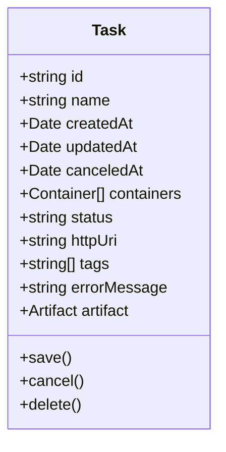
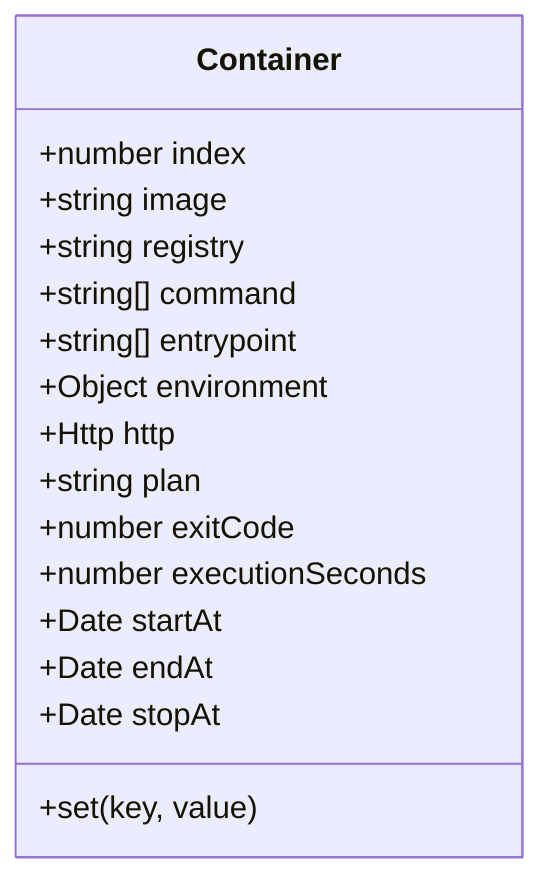
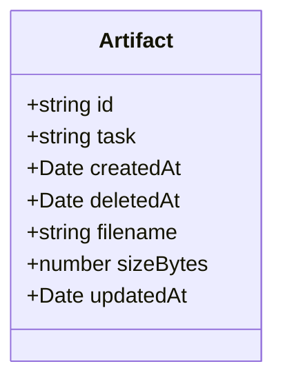
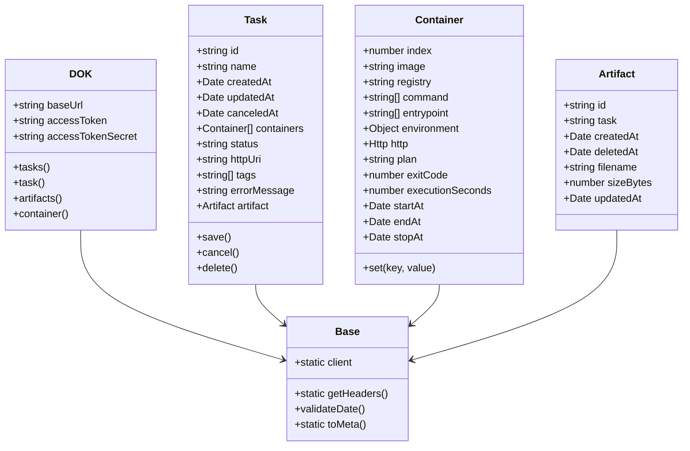
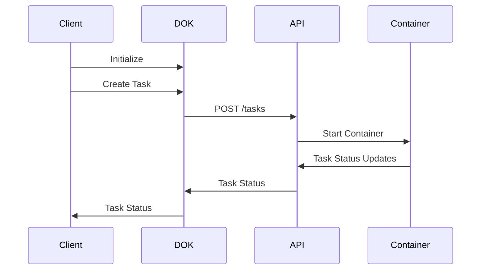

# DOK SDK Documentation

## 1. Introduction

### What is DOK?

DOK is a container-based GPU cloud service provided by Sakura Internet. It allows you to run containerized workloads on powerful GPUs (V100 or H100) with per-second billing. This service is particularly useful for:

- Machine Learning and AI workloads
- High-performance computing tasks
- GPU-accelerated applications
- Batch processing jobs

### What is DOK SDK?

DOK SDK is a TypeScript/JavaScript library that provides a simple and intuitive interface to interact with the DOK service. It abstracts away the complexity of making direct API calls and provides a more developer-friendly way to:

- Manage tasks and containers
- Handle artifacts
- Monitor costs
- Configure container registries

### Key Features

- 🚀 Simple and intuitive API
- 🔒 Secure authentication handling
- 📦 TypeScript support with type definitions
- 🔄 Asynchronous operations
- 📊 Comprehensive error handling
- 🎯 Pagination support for list operations

### System Requirements

- Node.js 14.0 or higher
- npm or yarn package manager
- TypeScript 4.0 or higher (for TypeScript projects)

## 2. Getting Started

### Installation

```bash
npm install @goofmint/dok-sdk
# or
yarn add @goofmint/dok-sdk
```

### Basic Configuration

```typescript
import DOK from '@goofmint/dok-sdk';

const dok = new DOK({
  accessToken: process.env.ACCESS_TOKEN,
  accessTokenSecret: process.env.ACCESS_TOKEN_SECRET,
});
```

### Authentication

DOK SDK uses Basic Authentication with your access token and secret. These credentials can be obtained from your Sakura Internet account.

```typescript
// Environment variables (recommended)
const dok = new DOK({
  accessToken: process.env.ACCESS_TOKEN,
  accessTokenSecret: process.env.ACCESS_TOKEN_SECRET,
});

// Direct configuration (not recommended for production)
const dok = new DOK({
  accessToken: 'your-access-token',
  accessTokenSecret: 'your-access-token-secret',
});
```

### First Steps

Here's a simple example to get you started:

```typescript
import DOK from '@goofmint/dok-sdk';

async function main() {
  // Initialize the client
  const dok = new DOK({
    accessToken: process.env.ACCESS_TOKEN,
    accessTokenSecret: process.env.ACCESS_TOKEN_SECRET,
  });

  // List all tasks
  const { tasks, meta } = await dok.tasks();
  console.log(`Found ${meta.count} tasks`);

  // Create a new task
  const task = await dok.task();
  task
    .set('name', 'my-first-task')
    .set('tags', ['test', 'example']);
  
  const container = await dok.container();
  container
    .set('image', 'your-container-image')
    .set('plan', 'v100-32gb');
  
  task.containers = [container];
  await task.save();
}

main().catch(console.error);
```

## 3. Core Concepts

### Tasks

Tasks are the fundamental unit of work in DOK. Each task represents a containerized workload that can be executed on a GPU.



### Containers

Containers define the runtime environment for your tasks. They specify the image to use, resource requirements, and environment variables.



### Artifacts

Artifacts are the output files generated by your tasks. They can be downloaded and used for further processing.



### Plans

Plans define the GPU resources available for your tasks. Currently supported plans are:

- `v100-32gb`: NVIDIA V100 GPU with 32GB memory
- `h100-80gb`: NVIDIA H100 GPU with 80GB memory
- `h100-2g.20gb`: NVIDIA H100 GPU with 20GB memory

### Costs

DOK charges based on the actual usage time of your tasks. The cost is calculated per second, making it cost-effective for both short and long-running workloads.

## 4. API Reference

### 4.1 Tasks API

#### Get Tasks

```typescript
const { tasks, meta } = await dok.tasks({
  page: 1,
  pageSize: 10
});
```

#### Get Task

```typescript
const task = await dok.task('task-id');
```

#### Create Task

```typescript
const task = await dok.task();
task
  .set('name', 'my-task')
  .set('tags', ['tag1', 'tag2']);

const container = await dok.container();
container
  .set('image', 'my-image')
  .set('plan', 'v100-32gb')
  .set('environment', {
    KEY: 'value'
  });

task.containers = [container];
await task.save();
```

#### Cancel Task

```typescript
await task.cancel();
```

#### Delete Task

```typescript
await task.delete();
```

### 4.2 Container Registry API

*Coming soon*

### 4.3 Artifacts API

#### Get Artifacts

```typescript
const { artifacts, meta } = await dok.artifacts({
  page: 1,
  pageSize: 10,
  task: 'task-id'
});
```

### 4.4 Plans API

*Coming soon*

### 4.5 Costs API

*Coming soon*

## 5. Architecture

### Class Structure



### Data Flow



## 6. Best Practices

### Task Management

1. **Use Meaningful Names**: Give your tasks descriptive names that reflect their purpose.
2. **Tag Your Tasks**: Use tags to organize and filter tasks.
3. **Monitor Task Status**: Regularly check task status to ensure proper execution.
4. **Clean Up**: Delete completed tasks to avoid unnecessary costs.

### Container Configuration

1. **Choose the Right Plan**: Select the appropriate GPU plan based on your workload requirements.
2. **Optimize Environment Variables**: Use environment variables for configuration.
3. **Set Resource Limits**: Configure appropriate resource limits for your containers.

### Resource Optimization

1. **Use Appropriate GPU**: Choose the right GPU for your workload.
2. **Monitor Costs**: Keep track of your usage to optimize costs.
3. **Batch Processing**: Combine multiple tasks when possible.

### Security Considerations

1. **Secure Credentials**: Never hardcode credentials in your code.
2. **Use Environment Variables**: Store sensitive information in environment variables.
3. **Regular Updates**: Keep the SDK updated to the latest version.

## 7. Examples

### Basic Task Creation

```typescript
import DOK from '@goofmint/dok-sdk';

async function createBasicTask() {
  const dok = new DOK({
    accessToken: process.env.ACCESS_TOKEN,
    accessTokenSecret: process.env.ACCESS_TOKEN_SECRET,
  });

  const task = await dok.task();
  task
    .set('name', 'basic-task')
    .set('tags', ['example']);

  const container = await dok.container();
  container
    .set('image', 'python:3.9')
    .set('plan', 'v100-32gb')
    .set('command', ['python', 'script.py'])
    .set('environment', {
      PYTHONPATH: '/app',
      DATABASE_URL: process.env.DATABASE_URL
    });

  task.containers = [container];
  await task.save();
}
```

### Advanced Container Configuration

```typescript
import DOK from '@goofmint/dok-sdk';

async function createAdvancedTask() {
  const dok = new DOK({
    accessToken: process.env.ACCESS_TOKEN,
    accessTokenSecret: process.env.ACCESS_TOKEN_SECRET,
  });

  const task = await dok.task();
  task
    .set('name', 'advanced-task')
    .set('tags', ['ml', 'training']);

  const container = await dok.container();
  container
    .set('image', 'tensorflow/tensorflow:latest-gpu')
    .set('plan', 'h100-80gb')
    .set('command', ['python', 'train.py'])
    .set('entrypoint', ['/bin/bash', '-c'])
    .set('environment', {
      CUDA_VISIBLE_DEVICES: '0',
      TF_FORCE_GPU_ALLOW_GROWTH: 'true',
      BATCH_SIZE: '32',
      EPOCHS: '100'
    });

  task.containers = [container];
  await task.save();
}
```

## 8. Troubleshooting

### Common Issues

1. **Authentication Errors**
   - Check if your access token and secret are correct
   - Ensure environment variables are properly set

2. **Task Creation Failures**
   - Verify container image exists
   - Check resource limits
   - Validate environment variables

3. **Container Execution Issues**
   - Check container logs
   - Verify GPU availability
   - Validate command and entrypoint

### Error Messages

Common error messages and their solutions:

- `Authentication credentials not provided`: Set your access token and secret
- `Invalid date format`: Check date format in your requests
- `Unknown key in container`: Verify container configuration keys

### Debugging Tips

1. **Enable Debug Logging**
   ```typescript
   process.env.DEBUG = 'dok-sdk:*';
   ```

2. **Check Task Status**
   ```typescript
   const task = await dok.task('task-id');
   console.log(task.status);
   ```

3. **Monitor Container Logs**
   ```typescript
   // Coming soon
   ```

## 9. API Reference

### Complete API Documentation

*Coming soon*

### Type Definitions

```typescript
// Task Status
type TaskStatus = 'waiting' | 'running' | 'error' | 'done' | 'aborted' | 'canceled';

// Plan Types
type DokPlan = 'v100-32gb' | 'h100-80gb' | 'h100-2g.20gb';

// Response Types
interface TasksResponse {
  meta: DokMeta;
  tasks: Task[];
}

interface ArtifactsResponse {
  meta: DokMeta;
  artifacts: Artifact[];
}
```

### Response Formats

*Coming soon*

## 10. Contributing

### Development Setup

1. Clone the repository
   ```bash
   git clone https://github.com/goofmint/dok-js.git
   cd dok-js
   ```

2. Install dependencies
   ```bash
   npm install
   ```

3. Set up environment variables
   ```bash
   cp .env.example .env
   # Edit .env with your credentials
   ```

### Testing

Run tests with:
```bash
npm test
```

### Code Style

- Follow TypeScript best practices
- Use ESLint for code linting
- Write unit tests for new features

### Pull Request Process

1. Fork the repository
2. Create a feature branch
3. Make your changes
4. Write tests
5. Submit a pull request

## License

MIT 