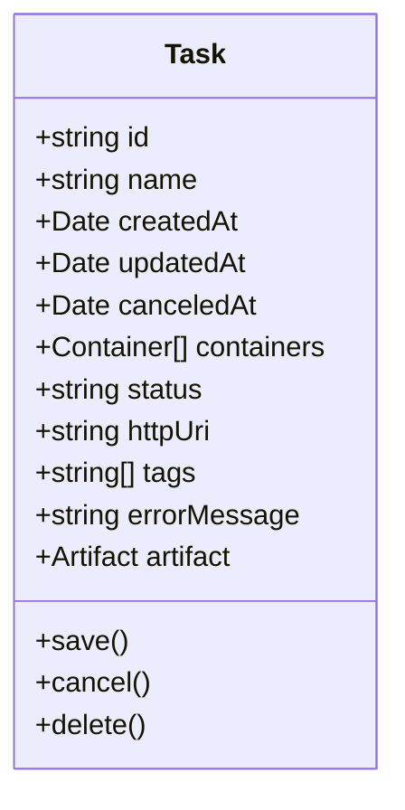
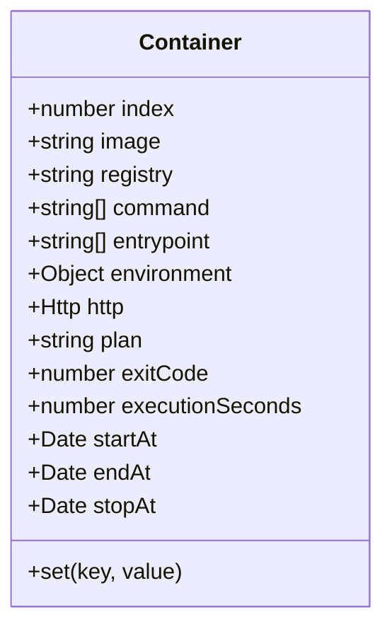
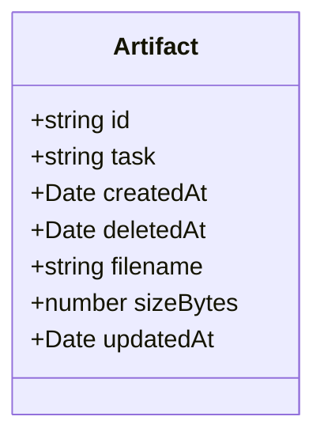
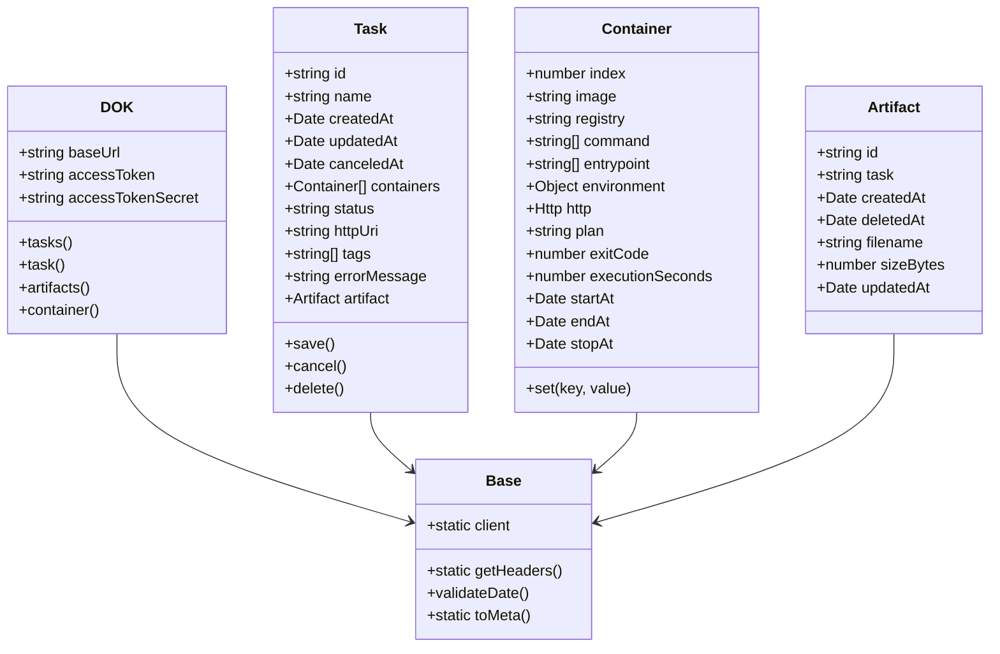
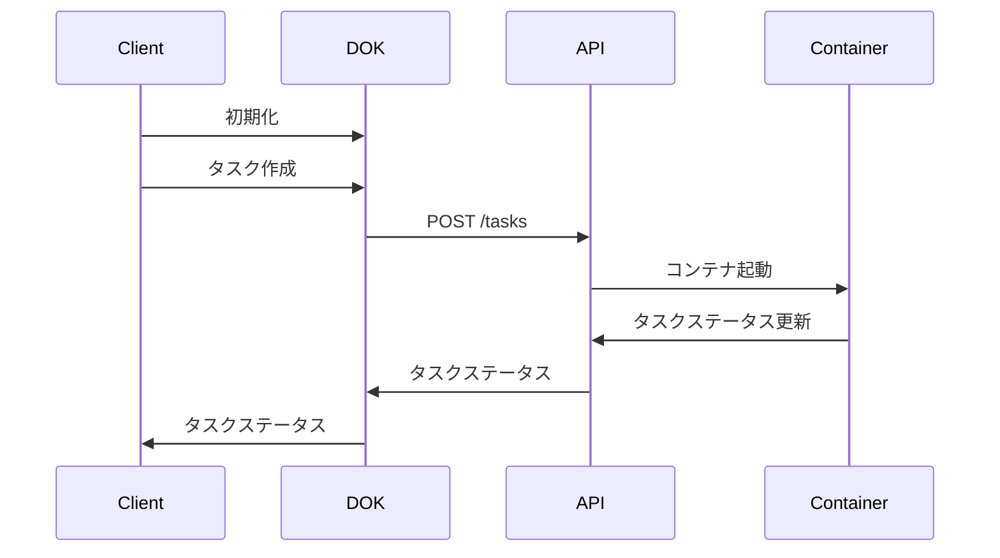

# DOK SDK ドキュメント

## 1. はじめに

### DOKとは

DOKは、さくらインターネットが提供するコンテナベースのGPUクラウドサービスです。V100やH100などの高性能GPUを秒単位の課金で利用でき、コンテナ化されたワークロードを実行することができます。このサービスは以下のような用途に特に適しています。

- 機械学習やAIワークロード
- 高性能コンピューティングタスク
- GPUアクセラレーションを活用したアプリケーション
- バッチ処理ジョブ

### DOK SDKとは

DOK SDKは、DOKサービスと対話するためのシンプルで直感的なインターフェースを提供するTypeScript/JavaScriptライブラリです。直接APIを呼び出す複雑さを抽象化し、以下のような操作をより開発者フレンドリーな方法で実現します。

- タスクとコンテナの管理
- アーティファクトの処理
- コストの監視
- コンテナレジストリの設定

### 主な特徴

- 🚀 シンプルで直感的なAPI
- 🔒 セキュアな認証処理
- 📦 TypeScriptの型定義サポート
- 🔄 非同期操作
- 📊 包括的なエラーハンドリング
- 🎯 リスト操作のページネーションサポート

### システム要件

- Node.js 14.0以上
- npmまたはyarnパッケージマネージャー
- TypeScript 4.0以上（TypeScriptプロジェクトの場合）

## 2. はじめ方

### インストール

```bash
npm install @goofmint/dok-sdk
# または
yarn add @goofmint/dok-sdk
```

### 基本設定

```typescript
import DOK from '@goofmint/dok-sdk';

const dok = new DOK({
  accessToken: process.env.ACCESS_TOKEN,
  accessTokenSecret: process.env.ACCESS_TOKEN_SECRET,
});
```

### 認証

DOK SDKは、アクセストークンとシークレットを使用したBasic認証を採用しています。これらの認証情報は、さくらインターネットのアカウントから取得できます。

```typescript
// 環境変数を使用（推奨）
const dok = new DOK({
  accessToken: process.env.ACCESS_TOKEN,
  accessTokenSecret: process.env.ACCESS_TOKEN_SECRET,
});

// 直接設定（本番環境では非推奨）
const dok = new DOK({
  accessToken: 'your-access-token',
  accessTokenSecret: 'your-access-token-secret',
});
```

### 最初のステップ

以下は、はじめての使用例です。

```typescript
import DOK from '@goofmint/dok-sdk';

async function main() {
  // クライアントの初期化
  const dok = new DOK({
    accessToken: process.env.ACCESS_TOKEN,
    accessTokenSecret: process.env.ACCESS_TOKEN_SECRET,
  });

  // すべてのタスクを取得
  const { tasks, meta } = await dok.tasks();
  console.log(`${meta.count}個のタスクが見つかりました`);

  // 新しいタスクを作成
  const task = await dok.task();
  task
    .set('name', 'my-first-task')
    .set('tags', ['test', 'example']);
  
  const container = await dok.container();
  container
    .set('image', 'your-container-image')
    .set('plan', 'v100-32gb');
  
  task.containers = [container];
  await task.save();
}

main().catch(console.error);
```

## 3. 基本概念

### タスク

タスクはDOKにおける基本的な作業単位です。各タスクは、GPU上で実行可能なコンテナ化されたワークロードを表します。



### コンテナ

コンテナは、タスクの実行環境を定義します。使用するイメージ、リソース要件、環境変数を指定します。



### アーティファクト

アーティファクトは、タスクによって生成される出力ファイルです。ダウンロードして後続の処理に使用できます。



### プラン

プランは、タスクで利用可能なGPUリソースを定義します。現在サポートされているプランは以下の通りです。

- `v100-32gb`: NVIDIA V100 GPU（32GBメモリ）
- `h100-80gb`: NVIDIA H100 GPU（80GBメモリ）
- `h100-2g.20gb`: NVIDIA H100 GPU（20GBメモリ）

### コスト

DOKは、タスクの実際の使用時間に基づいて課金されます。コストは秒単位で計算されるため、短時間のワークロードでも長時間のワークロードでもコスト効率が良いです。

## 4. APIリファレンス

### 4.1 タスクAPI

#### タスクの取得

```typescript
const { tasks, meta } = await dok.tasks({
  page: 1,
  pageSize: 10
});
```

#### タスクの取得（単一）

```typescript
const task = await dok.task('task-id');
```

#### タスクの作成

```typescript
const task = await dok.task();
task
  .set('name', 'my-task')
  .set('tags', ['tag1', 'tag2']);

const container = await dok.container();
container
  .set('image', 'my-image')
  .set('plan', 'v100-32gb')
  .set('environment', {
    KEY: 'value'
  });

task.containers = [container];
await task.save();
```

#### タスクのキャンセル

```typescript
await task.cancel();
```

#### タスクの削除

```typescript
await task.delete();
```

### 4.2 コンテナレジストリAPI

*準備中*

### 4.3 アーティファクトAPI

#### アーティファクトの取得

```typescript
const { artifacts, meta } = await dok.artifacts({
  page: 1,
  pageSize: 10,
  task: 'task-id'
});
```

### 4.4 プランAPI

*準備中*

### 4.5 コストAPI

*準備中*

## 5. アーキテクチャ

### クラス構造



### データフロー



## 6. ベストプラクティス

### タスク管理

1. **意味のある名前を使用**。タスクの目的を反映した説明的な名前を付けましょう。
2. **タグを活用**。タスクを整理し、フィルタリングするためにタグを使用しましょう。
3. **タスクステータスの監視**。適切な実行を確保するために定期的にタスクステータスを確認しましょう。
4. **クリーンアップ**。不要なコストを避けるために完了したタスクを削除しましょう。

### コンテナ設定

1. **適切なプランの選択**。ワークロードの要件に基づいて適切なGPUプランを選択しましょう。
2. **環境変数の最適化**。設定に環境変数を使用しましょう。
3. **リソース制限の設定**。コンテナに適切なリソース制限を設定しましょう。

### リソース最適化

1. **適切なGPUの使用**。ワークロードに適したGPUを選択しましょう。
2. **コストの監視**。コストを最適化するために使用状況を追跡しましょう。
3. **バッチ処理**。可能な場合は複数のタスクを組み合わせましょう。

### セキュリティ考慮事項

1. **認証情報の保護**。認証情報をコードにハードコードしないようにしましょう。
2. **環境変数の使用**。機密情報は環境変数に保存しましょう。
3. **定期的な更新**。SDKを最新バージョンに保ちましょう。

## 7. 使用例

### 基本的なタスク作成

```typescript
import DOK from '@goofmint/dok-sdk';

async function createBasicTask() {
  const dok = new DOK({
    accessToken: process.env.ACCESS_TOKEN,
    accessTokenSecret: process.env.ACCESS_TOKEN_SECRET,
  });

  const task = await dok.task();
  task
    .set('name', 'basic-task')
    .set('tags', ['example']);

  const container = await dok.container();
  container
    .set('image', 'python:3.9')
    .set('plan', 'v100-32gb')
    .set('command', ['python', 'script.py'])
    .set('environment', {
      PYTHONPATH: '/app',
      DATABASE_URL: process.env.DATABASE_URL
    });

  task.containers = [container];
  await task.save();
}
```

### 高度なコンテナ設定

```typescript
import DOK from '@goofmint/dok-sdk';

async function createAdvancedTask() {
  const dok = new DOK({
    accessToken: process.env.ACCESS_TOKEN,
    accessTokenSecret: process.env.ACCESS_TOKEN_SECRET,
  });

  const task = await dok.task();
  task
    .set('name', 'advanced-task')
    .set('tags', ['ml', 'training']);

  const container = await dok.container();
  container
    .set('image', 'tensorflow/tensorflow:latest-gpu')
    .set('plan', 'h100-80gb')
    .set('command', ['python', 'train.py'])
    .set('entrypoint', ['/bin/bash', '-c'])
    .set('environment', {
      CUDA_VISIBLE_DEVICES: '0',
      TF_FORCE_GPU_ALLOW_GROWTH: 'true',
      BATCH_SIZE: '32',
      EPOCHS: '100'
    });

  task.containers = [container];
  await task.save();
}
```

## 8. トラブルシューティング

### 一般的な問題

1. **認証エラー**
   - アクセストークンとシークレットが正しいか確認
   - 環境変数が正しく設定されているか確認

2. **タスク作成の失敗**
   - コンテナイメージが存在するか確認
   - リソース制限を確認
   - 環境変数を検証

3. **コンテナ実行の問題**
   - コンテナログを確認
   - GPUの可用性を確認
   - コマンドとエントリーポイントを検証

### エラーメッセージ

一般的なエラーメッセージとその解決方法。

- `Authentication credentials not provided`: アクセストークンとシークレットを設定してください
- `Invalid date format`: リクエストの日付形式を確認してください
- `Unknown key in container`: コンテナ設定のキーを確認してください

### デバッグのヒント

1. **デバッグログの有効化**
   ```typescript
   process.env.DEBUG = 'dok-sdk:*';
   ```

2. **タスクステータスの確認**
   ```typescript
   const task = await dok.task('task-id');
   console.log(task.status);
   ```

3. **コンテナログの監視**
   ```typescript
   // 準備中
   ```

## 9. APIリファレンス

### 完全なAPIドキュメント

*準備中*

### 型定義

```typescript
// タスクステータス
type TaskStatus = 'waiting' | 'running' | 'error' | 'done' | 'aborted' | 'canceled';

// プランタイプ
type DokPlan = 'v100-32gb' | 'h100-80gb' | 'h100-2g.20gb';

// レスポンスタイプ
interface TasksResponse {
  meta: DokMeta;
  tasks: Task[];
}

interface ArtifactsResponse {
  meta: DokMeta;
  artifacts: Artifact[];
}
```

### レスポンス形式

*準備中*

## 10. コントリビューション

### 開発環境のセットアップ

1. リポジトリのクローン
   ```bash
   git clone https://github.com/goofmint/dok-js.git
   cd dok-js
   ```

2. 依存関係のインストール
   ```bash
   npm install
   ```

3. 環境変数の設定
   ```bash
   cp .env.example .env
   # .envを編集して認証情報を設定
   ```

### テスト

テストの実行。
```bash
npm test
```

### コードスタイル

- TypeScriptのベストプラクティスに従う
- ESLintを使用してコードをリント
- 新機能には単体テストを書く

### プルリクエストのプロセス

1. リポジトリをフォーク
2. 機能ブランチを作成
3. 変更を加える
4. テストを書く
5. プルリクエストを提出

## ライセンス

MIT 